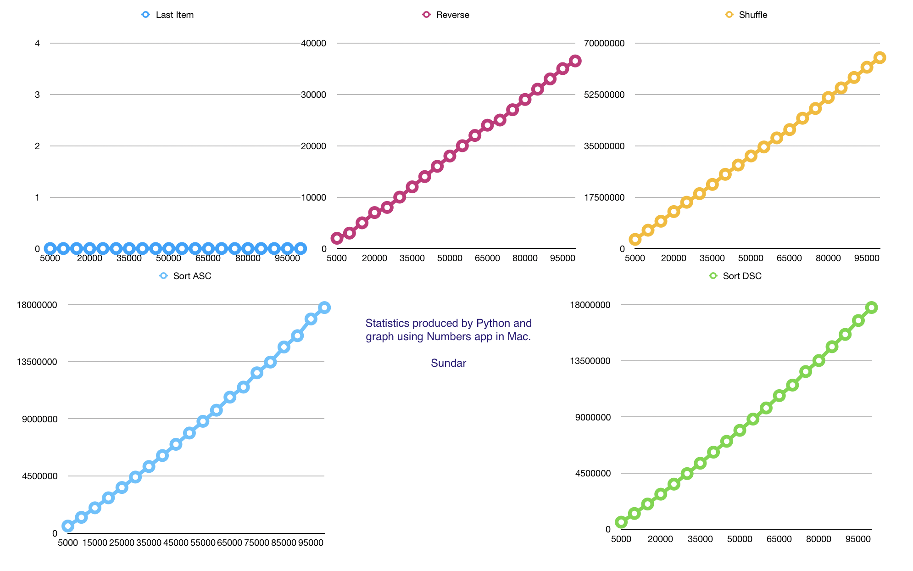

Algorithmic Complexity using Python - Sundar

From terminal run play.py (Anagram for PyAl - Python Algorithims)

Usage:
```
> ./play.py arg arg arg arg
```
where arg is of type integer example 5000 or 10000. Use space to delimit values
----------------------------------------------------------------------------------------------------
Data for the Graph (generated by play.py code)
-----------------------------------------------

